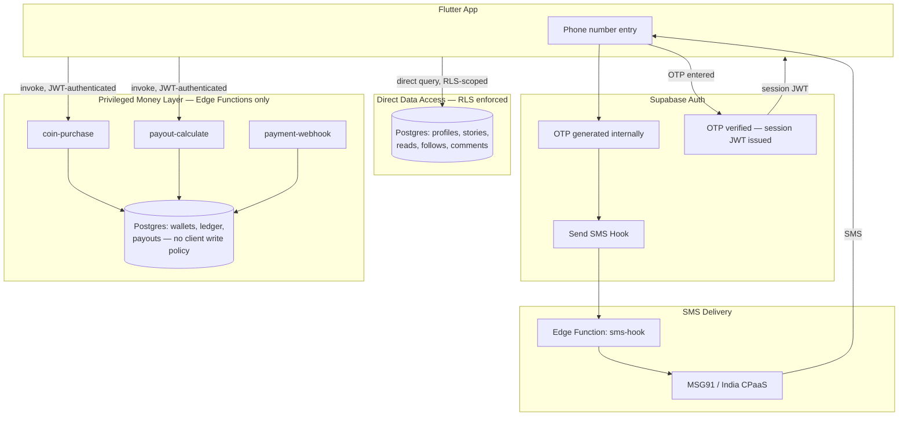

# Katha — Auth Architecture Decision & Build Prompt v1

## Decision

**Reject** the hybrid (Firebase Phone Auth → custom `katha-token` → Node API → Supabase).
**Reject** the Firebase-to-JWT-bridge as originally proposed (manual minting endpoint) — it's superseded by a native feature.
**Adopt** Pure Supabase: Supabase Auth for identity, Supabase's native **Send SMS Hook** wired to an India-native CPaaS provider for OTP delivery, RLS for all client data access, and Edge Functions reserved exclusively for money-movement logic.

This is not a compromise between the two paths the architect offered — it's Path 1, sharpened, with an explicit carve-out for revenue logic that neither path addressed.

---

## Why

1. **Firebase's only real advantage here was OTP reliability under India's DLT regime.** Supabase's Send SMS Hook removes that advantage — it lets Supabase generate and validate the OTP internally while delegating delivery to an India-native provider (MSG91 confirmed working in production via community-contributed hook integrations; ~₹0.12–0.15/OTP, native DLT routing). Once that gap is closed, keeping Firebase buys you nothing but a second identity system to secure, bill, and reason about.
2. **A Node API in front of Supabase for general reads/writes is dead weight.** RLS exists specifically so your Flutter client can talk to Postgres directly and securely. Routing everything through a custom token forces you to reimplement authorization logic you're already paying Supabase to provide.
3. **The manual Firebase-JWT-minting bridge (the architect's Path 2) is now unnecessary even as a fallback.** Supabase has a native Third-Party Auth integration for Firebase — register the Firebase project in Supabase's dashboard, pass Firebase's ID token via an `accessToken` callback, tag users with a `role: authenticated` custom claim. Zero custom minting code, zero JWT-secret handling on your side. If you ever *do* need Firebase (e.g., a future OAuth/social flow it handles better), this is the correct integration path — not a bespoke bridge.
4. **Money logic is the one place both proposed paths under-specified.** Coin purchases, wallet balances, and the 60/40 payout split must never be a client-authored write, even RLS-scoped to `auth.uid()`. RLS governs *row access*, not *arithmetic integrity*. That logic needs a trusted execution context — a Postgres function or Edge Function invoked with `service_role` — regardless of which auth path you pick. This is a small, deliberate, permanent exception to "no backend," not a reopening of the Node-API mistake.

---

## Architecture



---

## Build Prompt (hand this to your engineering team or coding agent)

```
Implement Katha's auth and data-access layer as follows. Do not deviate without
raising the tradeoff explicitly — these constraints are deliberate, not defaults.

AUTH
- Use Supabase Auth as the sole identity provider. Do not stand up Firebase Auth.
- Enable Phone (OTP) as the sign-in method.
- Configure a Send SMS Hook (Supabase Dashboard → Auth → Hooks) pointing to an
  Edge Function that forwards to an India-native SMS/CPaaS provider (MSG91 or
  equivalent DLT-registered provider). Supabase generates and validates the OTP;
  the hook only handles delivery.
- Do not issue any custom session token. The client uses the Supabase-issued
  session JWT directly for all subsequent requests.

DATA ACCESS
- All reads and non-monetary writes (profile, story content, chapters, follows,
  comments, reading progress) go directly from the Flutter client to Supabase's
  Data API, authorized via RLS policies keyed on auth.uid().
- Do not build a general-purpose REST/Node API layer for CRUD operations RLS can
  already express. If a query pattern seems to require one, treat that as a
  signal to write a Postgres function (SECURITY DEFINER where justified) instead.

MONEY LAYER (the one deliberate exception)
- Wallet balances, coin purchase confirmation, payout calculation, and the
  60/40 revenue-split ledger are NEVER written to by client-authored requests,
  even under RLS. These operations live in Edge Functions invoked with the
  service_role key, callable only via an authenticated user JWT.
- Payment gateway webhooks (Razorpay/Stripe/etc.) land on their own Edge
  Function, verified by webhook signature, writing directly to the ledger table.
- The wallets/ledger/payouts tables have RLS enabled with SELECT-only policies
  for the owning user (auth.uid() = user_id) and no INSERT/UPDATE policy for
  the client role at all — writes only happen via service_role inside the
  Edge Functions above.

FUTURE FIREBASE NEED (if it ever arises)
- If a future requirement needs Firebase specifically (e.g. a social login
  Supabase doesn't cover natively), integrate it via Supabase's native
  Third-Party Auth support for Firebase (Dashboard → Authentication →
  Third-Party Auth), passing the Firebase ID token through an accessToken
  callback. Do not hand-roll a JWT-minting bridge endpoint.

EXPLICITLY REJECTED
- A custom katha-token issued after OTP verification.
- A Node.js/Express API layer mediating general client-to-database traffic.
- Manual Firebase → Supabase JWT minting via a custom backend endpoint.
```

---

## Module 3: Session, Device & Subscription Policy (lean)

### Principle
Three separate clocks. Do not let any one of them stand in for another.
- **Session lifetime** — governed by Supabase's refresh-token mechanism. Free, default behavior.
- **Device count** — governed by counting/evicting rows in Supabase's own `auth.sessions`. No new subsystem.
- **Subscription validity** — governed by a live RLS lookup against `subscriptions.expires_at`. Never cached in a JWT claim.

### 1. Auth once, stay logged in (no build required)
`supabase_flutter` with `persistSession: true` and `autoRefreshToken: true` (defaults) keeps the
user signed in indefinitely via refresh-token rotation, with no re-authentication prompts. Do not
build custom "remember me" logic — this is already correct out of the box.

### 2. Device limit — reuse `auth.sessions`, no new service
- Client generates a UUID once at install, stored in `flutter_secure_storage`. No third-party
  device-fingerprinting SDK.
- Immediately after a successful sign-in, the client calls a single Edge Function (`register-device`)
  that, using `service_role`:
  1. Counts the user's active (non-expired) rows in `auth.sessions`.
  2. If the count exceeds the allowed limit (recommend **2** — phone + tablet), revokes the oldest
     session(s) beyond the limit.
  3. Returns the device count to the client.
- Client shows an eviction prompt when relevant ("Signed in on 2 other devices — continue and log
  the oldest one out?") rather than silently killing sessions.
- Do not enable Supabase's Pro-plan "single session per user" toggle — it's a recurring cost for a
  feature this Edge Function gives you for free, and it only supports exactly 1 device.
- Accept that a revoked session's access token remains valid until its own natural expiry (default
  up to 1 hour) — Supabase has no instant-kill. Leave JWT expiry at default rather than shortening
  it to close this gap; the bounded ≤1hr window is the correct lean tradeoff for a ₹99/month product.

### 3. Subscription gating — live check, never a cached claim
- `subscriptions` table: `user_id`, `expires_at`, `status`. Written only by the payment-webhook
  Edge Function (Module 2's money layer), never by the client.
- RLS policies on paid content tables check subscription status live:
  `EXISTS (SELECT 1 FROM subscriptions WHERE user_id = auth.uid() AND expires_at > now())`
- Do not use a Custom Access Token Hook to bake `is_subscribed` into the JWT — claims only refresh
  when the access token refreshes (up to 1 hour stale), which either leaks paid content past
  expiry or locks out a user who just paid.

### 4. Free-to-paid funnel
- Use Supabase anonymous sign-in for guest browsing of free chapters, preserving reading progress
  under a real (if temporary) session.
- Upgrade the anonymous identity to a real one (Google / phone / email) at the paywall or at
  registration — auth must resolve to a real `user_id` *before* the payment call fires, since the
  payment webhook needs an identity to attach the subscription row to.

### Net new infrastructure for this module
One Edge Function (`register-device`). No new paid tier, no new vendor, no new persistent table
beyond what Supabase already maintains in `auth.sessions` and the `subscriptions` table already
required by the money layer.

---

## Full Implementation Prompt (paste into Claude Code / hand to engineering)

This consolidates every decision above — auth, money layer, and session/device/subscription
policy, including device-change handling — into one directive. Paste as-is; it's written to be
followed literally, not interpreted.

```
Implement Katha's auth, session, and money-layer architecture exactly as follows. Every
constraint below is deliberate. If a step seems to require deviating from one, stop and raise
the tradeoff explicitly rather than silently choosing a different approach.

═══════════════════════════════════════════
1. AUTH — identity layer
═══════════════════════════════════════════
- Supabase Auth is the sole identity provider. Do not stand up Firebase Auth or any parallel
  identity system.
- Enable Phone (OTP) sign-in. Configure a Send SMS Hook (Auth → Hooks) pointing to an Edge
  Function that forwards to an India-native, DLT-registered SMS provider (MSG91 or equivalent).
  Supabase generates/validates the OTP internally; the hook only handles delivery.
- Implement Google sign-in via Credential Manager (NOT the legacy/deprecated Android One Tap
  SDK) using the `google_sign_in` Flutter package, feeding the resulting ID token to
  `supabase.auth.signInWithIdToken()`.
  - On first sign-in on a device, show the explicit account picker — do not enable
    `setAutoSelectEnabled()` silent auto-select. Shared family devices are common in this
    market and silent selection risks signing a user into the wrong Google account on an
    account that holds a paid wallet.
  - Auto-select may be enabled only after a device has already confirmed itself once via an
    explicit picker choice.
- Provide a visible manual fallback ("Continue with email") for users who dismiss the Google
  prompt or lack Play Services. Use Supabase magic links / email OTP for this path.
  - Configure custom SMTP (e.g. Resend) for auth emails before production launch. Supabase's
    default email sender is rate-limited (a few emails/hour) and explicitly unsuitable for
    production — do not rely on it past initial testing.
- Guest browsing of free content uses Supabase anonymous sign-in. Upgrade the anonymous
  identity to a real one (Google/phone/email) at the paywall or explicit registration point.
  Auth must resolve to a permanent user_id BEFORE any payment call fires — the payment webhook
  needs an identity to attach the subscription record to.
- Do not issue any custom session token (no "katha-token"). The client uses the Supabase-issued
  session JWT directly everywhere.

═══════════════════════════════════════════
2. DATA ACCESS — default to direct + RLS
═══════════════════════════════════════════
- All reads and non-monetary writes (profile, story content, chapters, follows, comments,
  reading progress) go directly from the Flutter client to Supabase's Data API, authorized by
  RLS policies keyed on auth.uid().
- Do not build a general-purpose REST/Node API layer for anything RLS can already express.

═══════════════════════════════════════════
3. MONEY LAYER — the one exception to "no backend"
═══════════════════════════════════════════
- Wallet balances, coin purchase confirmation, payout calculation, and the revenue-split ledger
  are written ONLY by Edge Functions running with service_role — never by client-authored
  writes, even under RLS.
- Payment gateway webhooks land on their own signature-verified Edge Function, writing directly
  to the ledger.
- `wallets` / `ledger` / `payouts` tables: RLS enabled, SELECT-only policy for the owning user
  (auth.uid() = user_id), no client INSERT/UPDATE policy at all.

═══════════════════════════════════════════
4. SESSION PERSISTENCE — no build required
═══════════════════════════════════════════
- Use supabase_flutter defaults: persistSession: true, autoRefreshToken: true. This keeps users
  signed in indefinitely via refresh-token rotation. Do not build custom "remember me" logic.

═══════════════════════════════════════════
5. DEVICE LIMIT & DEVICE-CHANGE HANDLING
═══════════════════════════════════════════
Schema:
  user_devices (
    user_id      uuid references auth.users,
    device_id    uuid,            -- client-generated, stored in flutter_secure_storage
    session_id   uuid,            -- matches the session_id claim in the issued JWT
    device_label text,            -- e.g. "Redmi Note 13", captured via device_info_plus
    first_seen   timestamptz,
    last_seen    timestamptz,
    primary key (user_id, device_id)
  )

Edge Function `register-device` (service_role), called by the client immediately after every
successful sign-in:
  1. Upsert a row in user_devices for this (user_id, device_id), updating last_seen.
  2. Count this user's currently active sessions.
  3. If the count exceeds the allowed limit (default: 2 concurrent devices):
     - Identify the device(s) to evict by LEAST RECENTLY ACTIVE (last_seen / last-refreshed
       timestamp) — NOT by earliest creation date. A device that hasn't refreshed its session
       recently is presumed abandoned (e.g. user upgraded phones); a device that's still
       actively refreshing is presumed genuinely in concurrent use.
     - If exactly one device is clearly stale (no activity beyond a defined threshold, e.g. 14
       days), evict it automatically and silently — this is the normal "user got a new phone"
       path and should require no user action.
     - If multiple devices are all recently active, do NOT auto-evict. Return the device list to
       the client and let the user choose which to log out via a confirmation prompt.
  4. Return the current device list (id, label, last_seen) to the client either way.

Do NOT:
  - Enable Supabase's Pro-plan "enforce single session per user" setting — it's a recurring
    cost for something this Edge Function does for free, and only supports exactly 1 device.
  - Use any third-party device-fingerprinting/fraud-detection SDK. A client-generated UUID in
    secure storage is sufficient at this stage.
  - Shorten the default JWT expiry to force faster eviction. A revoked session's access token
    remains valid until its own natural expiry (~1hr default) — accept this as the lean
    tradeoff rather than engineering around it.

Self-service "Manage devices" screen (Flutter):
  - List rows from user_devices for the current user (label + last_seen).
  - "Log out this device" button calls a `revoke-device` Edge Function (service_role) that
    deletes the corresponding session and the user_devices row.
  - This handles the case where a user proactively wants to free a slot (still has their old
    phone, or lost it and is now on a new one) without waiting for staleness-based auto-eviction.

═══════════════════════════════════════════
6. SUBSCRIPTION GATING — live check, never cached
═══════════════════════════════════════════
- subscriptions (user_id, expires_at, status) — written ONLY by the payment-webhook Edge
  Function from section 3, never by the client.
- RLS policies on paid content check subscription status live on every read:
  EXISTS (SELECT 1 FROM subscriptions WHERE user_id = auth.uid() AND expires_at > now())
- Do NOT use a Custom Access Token Hook to bake is_subscribed into the JWT. Claims only refresh
  when the access token itself refreshes (up to 1hr stale by default), which either leaks paid
  content past expiry or locks out a user who just paid.

═══════════════════════════════════════════
EXPLICITLY REJECTED (do not implement, do not suggest as an alternative)
═══════════════════════════════════════════
- Custom katha-token / general-purpose Node.js API layer mediating client-to-database traffic.
- Legacy Android One Tap SDK (deprecated — use Credential Manager).
- Silent auto-select Google sign-in on a device's first login.
- Manual Firebase→Supabase JWT-minting bridge (superseded by Supabase's native Firebase
  Third-Party Auth integration, and unnecessary here since Firebase isn't in this stack anyway).
- Supabase Pro-plan single-session enforcement as the device-limit mechanism.
- Custom Access Token Hook for device count or subscription status.
- Device eviction based on session creation order instead of last-active staleness.
- Third-party device-fingerprinting SDKs.
```

---

## Note on Firebase's original justification

The DLT/telecom-scrubbing argument for Firebase was real and worth taking seriously — it's why India-specific SMS routing matters at all. The resolution isn't "Firebase was wrong to consider," it's that Supabase's Send SMS Hook lets you solve the same delivery problem without giving up a unified identity layer. If MSG91 (or whichever provider you pilot) turns out to have reliability issues in testing, the fallback is swapping the SMS provider behind the hook — not reintroducing Firebase.
